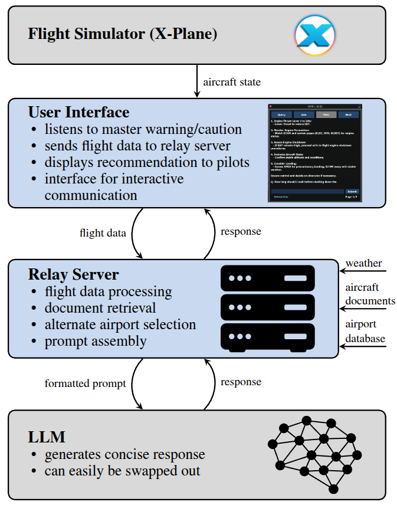

# LeRAAT: LLM-Enabled Real-Time Aviation Advisory Tool

This repository contains all the code that is necessary to run the LLM pilot assistant that is described in the paper: *LeRAAT: LLM-Enabled Real-Time Aviation Advisory Tool*. Specifically:

1. Use RAG with GPT 4o to ask specific questions about the A320
2. Build the prompts based of flight data and ECAM messages
3. A custom plugin (`./XPPlugin/PI_AI_Assistant.py`) based on XPPython3 to integrate with X-Plane that acts as visual front end for the pilot and handles the communication with the relay server (`./RelayServer/main.py`)
4. Communication between the plugin and the relay server based on ZeroMQ

In the following, we will cover the requirements for each individual component and setup instructions. 

The overall architecture is depcited in the following figure.

<p align="center">
   
</p>


> **Note**: We provide a *mock plugin* that can be found in `./RelayServer/mock_xp_plugin.py` that allows to some extend to test different aspects of the LLM without X-Plane being in the loop. More details, please see the *Mock-XP Plugin* section.

## Demo Video
In addition the the paper and this repository, we also released a [demo video](https://www.youtube.com/watch?v=RseBY-rOugQ) showing the full capabilities of the AI assistant.

[](https://www.youtube.com/watch?v=RseBY-rOugQ)

## General Requirements
The entire setup is built around the following two software packages:

- X-Plane 12 (We use XP12.1.2)
- Toliss A320NEO (We use version 1.04)

In our develpment, we us a combination of machines with Windows 10 and Ubuntu 22.04 and we don't observe any significant differences between the two machines. There are some important pieces of information about the Windows firewall settings which are addressed in the notes aboute ZeroMQ. Our setup is specifically tailored to the Toliss A320NEO plugin which to the best of our knowledge represents the most in-depth simulation of an A320NEO available for X-Plane at the moment. Many aspects of our work are translatable to other aircraft types and plugins, some processes such as the readout of the ECAM messages are specific to the A320 plugin we are using.

## Relay Server

### Requirements
The relay server has the following jobs:

- receive structured input from the XP plugin with flight data, and ECAM messages
- format the prompt
- RAG document retrieval
- handling communication with an LLM backend (we use OpenAI's API as backend)
- shortening verbose LLM answers via a second call to the LLM backend
- forwarding the final response to the XP plugin for in-cockpit display

A dedicated readme for the setup can be found [here](./RelayServer/README.md).

> **Important**: The code expects to find an OpenAI API key as environment variable with the following name: `OPENAI_API_KEY`. You can check if your key is correctly setup by checking that `echo $OPENAI_API_KEY` is actually your API key.

The relay server will only work with python environments up to Python 3.10 due to relying on the `FAISS` package. In the future, this might change, but as of now, we did not have any success running it on versions >3.10. For simplicity, we provide a bash script `./RelayServer/create_env.sh` that creates a conda environment (a conda installation is required) and installs all the required packages.

The requirements specify the CPU version of FAISS (`faiss-cpu`), however, if you have a dedicated GPU on your machine, it might be beneficial to install the GPU version (`faiss-gpu`) for better performance.

> **Important**: For RAG, the relay server expects to find markdown documents in the `./RelayServer/data/md_rag_files/` directory. In the paper, we are using the A320NEO Airplane Flight Manual (AFM). However, due to copyright issues, we cannot include the files as part of this repository, however, you can find them online based on a quick Google search. Place the files in `./RelayServer/data/pdf_rag_files/` and subsequently run `./RelayServer/pdf2md.py` from within the `./RelayServer/` directory to convert them markdown

Currently, ZeroMQ expects to receive messages on TCP port 5555, however, this can be changed in the following line:

```
socket.bind("tcp://*:5555")
```

Makes sure your firewall accepts incoming connections on port 5555 for TCP (by default, this will be disabled on most systems). If the request is coming from the same machine (i.e., you are running the mock plugin or X-Plane on the same machine as the relay server), no firewall modifications will be necessary.

### Use
The main script expects to be run from **WITHIN** the `./RelayServer` directory. After starting `./RelayServer/main.py`, you will see a similar terminal output:

```
2024-11-13 14:46:35,268 - root - INFO - Starting main function
2024-11-13 14:46:35,269 - root - INFO - Loaded 1 Markdown documents from data
2024-11-13 14:46:35,289 - root - INFO - Split documents into 1623 chunks
2024-11-13 14:46:39,499 - httpx - INFO - HTTP Request: POST https://api.openai.com/v1/embeddings "HTTP/1.1 200 OK"
2024-11-13 14:46:41,794 - httpx - INFO - HTTP Request: POST https://api.openai.com/v1/embeddings "HTTP/1.1 200 OK"
2024-11-13 14:46:42,485 - faiss.loader - INFO - Loading faiss with AVX2 support.
2024-11-13 14:46:42,485 - faiss.loader - INFO - Could not load library with AVX2 support due to:
ModuleNotFoundError("No module named 'faiss.swigfaiss_avx2'")
2024-11-13 14:46:42,485 - faiss.loader - INFO - Loading faiss.
2024-11-13 14:46:42,494 - faiss.loader - INFO - Successfully loaded faiss.
2024-11-13 14:46:42,610 - root - INFO - Created ensemble retriever
2024-11-13 14:46:42,610 - root - INFO - Setting up GPT-4o-mini client
2024-11-13 14:46:42,634 - root - INFO - GPT-4o-mini client set up successfully
```

Once a message received via ZeroMQ, all the payload of the message (we use a dictionary) will be displayed. This output might look overwhelming, but can be helpful for debugging:

```
----------------------MESSAGE RECEIVED----------------------
--------------------------------------------------------------------------------
{'status': 'update', 'master_warning': 0, 'master_caution': 1, 'AirbusFBW/EWD1wText': '', 'AirbusFBW/EWD1gText': '', 'AirbusFBW/EWD1bText': '', 'AirbusFBW/EWD1aText': 'hyd G ENG 1 PUMP LO PR  *F/CTL', 'AirbusFBW/EWD1rText': '', 'AirbusFBW/EWD2wText': '', 'AirbusFBW/EWD2gText': '', 'AirbusFBW/EWD2bText': ' -G ENG 1 PUMP.......OFF', 'AirbusFBW/EWD2aText': '                        *WHEEL', 'AirbusFBW/EWD2rText': '', 'AirbusFBW/EWD3wText': '', 'AirbusFBW/EWD3gText': '                        HYD PTU', 'AirbusFBW/EWD3bText': '', 'AirbusFBW/EWD3aText': '', 'AirbusFBW/EWD3rText': '', 'AirbusFBW/EWD4wText': '', 'AirbusFBW/EWD4gText': '', 'AirbusFBW/EWD4bText': '', 'AirbusFBW/EWD4aText': '', 'AirbusFBW/EWD4rText': '', 'AirbusFBW/EWD5wText': '', 'AirbusFBW/EWD5gText': '', 'AirbusFBW/EWD5bText': '', 'AirbusFBW/EWD5aText': '', 'AirbusFBW/EWD5rText': '', 'AirbusFBW/EWD6wText': '', 'AirbusFBW/EWD6gText': '', 'AirbusFBW/EWD6bText': '', 'AirbusFBW/EWD6aText': '', 'AirbusFBW/EWD6rText': '', 'AirbusFBW/EWD7wText': '', 'AirbusFBW/EWD7gText': '', 'AirbusFBW/EWD7bText': '', 'AirbusFBW/EWD7aText': '', 'AirbusFBW/EWD7rText': '', 'sim/flightmodel/position/latitude': 25.7336368560791, 'sim/flightmodel/position/longitude': -80.91637420654297, 'sim/flightmodel/position/elevation': 3482.58447265625, 'sim/flightmodel/position/indicated_airspeed': 279.636962890625, 'sim/flightmodel/position/y_agl': 3480.38818359375, 'sim/flightmodel/position/vh_ind_fpm': -4.118183135986328, 'sim/flightmodel/position/mag_psi': 257.3198547363281}
--------------------------------------------------------------------------------
```

The keys of the dictionary are mostly X-Plane DataRefs. DataRefs are variables that X-Plane exposes through their SDK (or UDP) to interact with the simulator. There is a large number of DataRefs that are universal to X-Plane. Those can be found [here](https://developer.x-plane.com/datarefs/). However, plugins oftentimes specifcy a number of additional DataRefs. This is also the case for the Toliss A320NEO plugin.

As outlined above, there is a two-step process for obtaining a relevant and short LLM response (with the idea to avoid overwhelming the pilots):

1. Retrieving all the relevant information (this is done with the `generate_gpt_response` method in `./RelayServer/main.py`)
2. Shortening the answer (this done using the `shorten_gpt_response` method in `./RelayServer/main.py`)

For debugging purposes, both the long and shortened LLM responses are displayed, however, only the shortened response is sent to the X-Plane Plugin.

```
Long Answer: Given the provided ECAM messages and flight data for the A320, the following immediate steps should be taken to manage the situation and ensure the aircraft remains in a safe state:

1. **ECAM Actions**:
   - Address the ECAM alert "HYD G ENG 1 PUMP LO PR":
     - Turn off the associated engine pump, as indicated by "G ENG 1 PUMP.......OFF (blue)" on the ECAM. This is to prevent further damage or issues with the hydraulic system.

2. **Flight Control and System Management**:
   - Monitor the effects on flight control due to the hydraulic issue. With "F/CTL" and "WHEEL" highlighted in amber, expect possible changes to control laws or effects on wheel braking.  
   - Confirm which hydraulic systems are still operational (red alert indicates LAND ASAP, implying critical hydraulic functionality might be impaired). 
   - Expect and prepare for potential changes to flight control laws (e.g., Alternate Law), as indicated under "Remaining Systems."

3. **Pilot Flying Assignment**:
   - Ensure the left-hand seat pilot (Captain) becomes the Pilot Flying (PF) due to PFD1 availability only.

4. **Safety Notifications**:
   - Declare an emergency to ATC using the phrase "MAYDAY" to indicate a serious emergency and gain priority with air traffic control.

5. **Landing Considerations**:
   - Plan to land at the nearest suitable airport equipped for emergency landings. Consult with ATC on weather and field conditions to select an appropriate diversion; avoid airports with inadequate facilities, especially if weather conditions are marginal.

6. **Continuous Monitoring**:
   - Continuously monitor flight controls and remaining hydraulic systems. Execute further ECAM procedures or QRH guidance based on additional messages or changes in system status.

7. **Further Actions**:
   - Once stabilized, coordinate the continuation of ECAM actions and reconfiguration as necessary, ensuring all critical actions are addressed and documented.
  
These actions will help in managing the hydraulic issue effectively while maintaining safe control of the aircraft.
--------------------------------------------------------------------------------
Short Answer: 1. **ECAM Actions**:
   - "HYD G ENG 1 PUMP LO PR": Turn off G ENG 1 PUMP.

2. **Flight Control and System Management**:
   - Monitor changes to flight controls and wheel braking.
   - Assess operational hydraulic systems.

3. **Pilot Flying Assignment**:
   - Captain becomes Pilot Flying (PF).

4. **Safety Notifications**:
   - Declare "MAYDAY" to ATC.

5. **Landing Considerations**:
   - Plan to land at the nearest suitable airport.

6. **Continuous Monitoring**:
   - Monitor flight controls and hydraulic systems.

7. **Further Actions**:
   - Continue ECAM and QRH procedures as necessary.

```

> **Note**: The GPT versions that are accessible through the OpenAI API use so-called state-less models. Their behavior is different from the behavior that is known through the ChatGPT website where a conversation history is taken into consideration. Our *interactive* state which is described in detail in the [technical report](./report/Airbus_Report_2024_FINAL.pdf) mimics the ChatGPT-like behavior.

## Mock-XP Plugin
We recognize that not everyone will have the full setup including X-Plane and the Toliss A320NEO and in fact, the entire setup takes quite a bit of effort. Therefore, we provide an abstraction that allows to only interact with the LLM given a set of hardcoded flight data parameters and ECAM messages.

### Requirements
The mock plugin can be found in `./RelayServer/mock_xp_plugin.py`. The only external library that is required is `pyzmq`. Make sure to modify the line

```
SERVER_URI = "127.0.0.1:5555"
```

to reflect the IP address and port where the relay server can be reached. The default expects the relay server on port 5555 on the same machine. If you are running the mock plugin and the relay server on a separate machine, make sure the firewalls (both, system firewalls and network firewalls) are configured accordingly. For the network firewall, you might need to talk with the IT department of implementing special rules if there is a firewall between the two machines.

### Use
Upon starting `python3 ./RelayServer/mock_xp_plugin.py`, the plugin will send the data as specified in the `DATA` dictionary to the relay server (need to be started first). The `DATA` dictionary contains data from a ENG 2 FIRE. You can modify the dictionary for different scenarios. Commented out, there are also cases for the interactive mode and to reset the assistant (via the *Arm* button).

After receiving a response from the relay server (the relay server only sends the shortened response back), this message is displayed. This message is what pilots would see in the cockpit.

```
python3 ./AirbusLLM/mock_xp_plugin.py 
1. **ECAM Actions**:
   - "HYD G ENG 1 PUMP LO PR": Turn off G ENG 1 PUMP.

2. **Flight Control and System Management**:
   - Monitor changes to flight controls and wheel braking.
   - Assess operational hydraulic systems.

3. **Pilot Flying Assignment**:
   - Captain becomes Pilot Flying (PF).

4. **Safety Notifications**:
   - Declare "MAYDAY" to ATC.

5. **Landing Considerations**:
   - Plan to land at the nearest suitable airport.

6. **Continuous Monitoring**:
   - Monitor flight controls and hydraulic systems.

7. **Further Actions**:
   - Continue ECAM and QRH procedures as necessary.
```

## X-Plane LLM Plugin

### Installation
A detailed installation instructions can be found in the dedicated [readme](./XPPlugin/README.md).

> **Note**: A working installation of X-Plane 12 with an installation of XPPython3 is absolutely necessary to run the plugin. The plugin references DataRefs that are specific to the Toliss A320NEO. To adapt the plugin to work with different aircrafts, the referenced DatRefs in `./XPPlugin/PI_AI_Assistant.py` need to be altered. Also keep in mind that the relay server expects the same DataRefs, so switching aircraft types (with different DataRefs) also requires modiyfing `./RelayServer/main.py`

### Use


The LLM assistant operates on a discrete state-based model. There are three states: armed, active, and interactive. While in  *armed* state, the LLM assistant listens to any master warnings or master cautions that automatically trigger a transition into the active state. A transition can also manually happen by pressing the *Query* button on the user interface. The *active* state is characterized by an LLM response being displayed (or waiting for the response being sent). A refreshed response can be generated through the *Query* button. To go back into the *armed* state, the user needs to click the *Arm* button. At any point the *interactive* state can be triggered by typing in the text box which mimics a ChatGPT-like behavior where the assistant is aware of previous interactions. More information about the transitions between the different states can be found in the [technical report](./report/Airbus_Report_2024_FINAL.pdf) Below, is the GUI depicted. 


To start the plugin, reload the Python Plugins in X-Plane through *Plugins > XPPython3 > Relead Scripts*. The GUI can be opened through *Plugins > A320 LLM*. 

> **Note**: If you restart the relay server, you also need to restart the Python plugins through *Reload Scripts*.


> **Note**: Should debugging be necessary, the `XPPythonLog.txt` file in the home directory of X-Plane will be helpful as all the Python-related errors of the plugin will be logged there.


